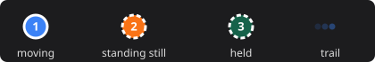

# Radar widget

The **Sensy radar** widget shows a live top-down radar of one sensor on a Homey dashboard: the people it sees,
your zones, and whether anyone is present.

## Adding the widget

1. Open a dashboard and choose **Edit**.
2. Add a widget and pick **Sensy radar** (from the Sensy S1 Pro app).
3. In the widget settings, choose the **Sensor**. Start typing its name; the list also shows whether each sensor
   is online.

Without a chosen sensor, the widget shows the first S1 Pro of the app.

## What you see

- **Header**: a dot that is lit while the sensor is connected, the sensor's name, and a status pill:
    - *Empty* when nobody is present;
    - *2 present* when people are present but not moving;
    - *2 moving* when someone moves.
- **Radar map**: the sensor at the bottom centre, the field of view, distance lines, and your zones. A zone
  lights up while someone is inside it. The exclusion zone is drawn in red.
- **People** as numbered markers that glide to their new position, with a short fading trail.

The map scales with the [detection range](settings.md#detection): a larger range zooms out.

## Markers

{ width="420" }

| Marker | Meaning |
|---|---|
| **Solid** | The person moves. |
| **Dashed ring** | The person stands or sits still (below the *Stationary speed*). |
| **Dashed and faded** | The person stood still long enough to be *held*: the [holding engine](settings.md#tracking) keeps them in place, also when the radar briefly loses them. |
| **Trail** | The last positions, fading out. |

Each of the three people the radar can track has its own colour (blue, orange, green), so you can follow one
person across the map. The same markers appear in the [zone editor](zones.md).

!!! note
    Firmware without per-person states (for example a custom build) shows every marker as solid.

## Updates

The widget updates live, several times per second while people move, without polling. When the sensor goes
offline the dot turns off, and it picks up again by itself when the sensor is back. Changes to zones (from the
zone editor or elsewhere) appear right away.
