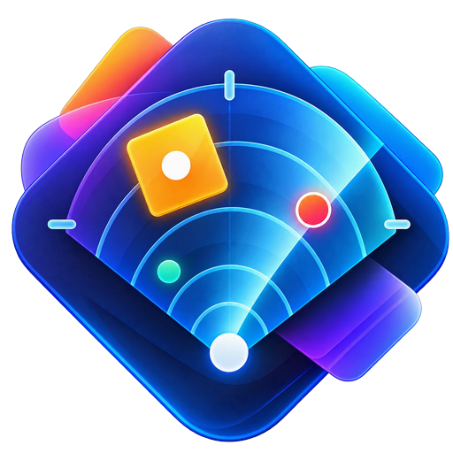
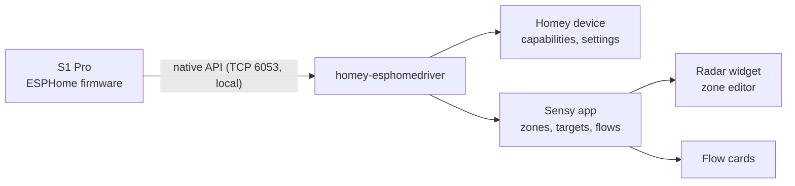

---
hide:
  - navigation
---

# Sensy S1 Pro for Homey

A Homey app for the **[Sensy-One S1 Pro Multi Sense](https://github.com/sensy-one/S1-Pro-Multi-Sense)**: mmWave
presence that also sees people who sit still, up to three zones, people counting and a full set of environment
sensors, straight from the sensor to Homey over the local ESPHome native API. No Home Assistant, no MQTT broker
and no cloud.

!!! info "Unofficial community project"
    This app is not made, endorsed or supported by Sensy-One. It works with the official Sensy-One firmware.

## What you get

-   :material-account-multiple: **Presence, movement and people**

    ---

    Presence that stays on while you sit still, movement, and the number of people in the room. Homey's
    zone activity follows the sensor.

    [:octicons-arrow-right-24: The device](guide/device.md)

-   :material-vector-polygon: **Zones**

    ---

    Draw up to three zones and an exclusion zone on a live radar map. Each zone gets its own presence,
    movement and people count, flow cards and settings.

    [:octicons-arrow-right-24: Zones and the zone editor](guide/zones.md)

-   :material-radar: **Radar widget**

    ---

    A dashboard widget that shows people moving through the room, standing still or being held by the
    radar, with zones that light up on presence.

    [:octicons-arrow-right-24: Radar widget](guide/widget.md)

-   :material-air-filter: **Air quality and climate**

    ---

    CO₂, an indoor air quality index with a plain-language class, VOC, temperature, humidity, pressure,
    light and UV.

    [:octicons-arrow-right-24: Air quality](guide/air-quality.md)

-   :material-sitemap: **Flows**

    ---

    Triggers, conditions and actions for the room, every zone, air quality and new firmware.

    [:octicons-arrow-right-24: Flows](guide/flows.md)

-   :material-tune: **Every setting of the sensor**

    ---

    Detection range, hold times, the radar's tracking, calibration, buzzer and more, kept in sync with the
    sensor in both directions.

    [:octicons-arrow-right-24: Device settings](guide/settings.md)

## Quick start

1. Check the [requirements](getting-started/requirements.md): a Homey Pro (2023) or Homey Pro mini on
   Homey 13 or newer, and the S1 Pro on the official firmware.
2. [Install the app](getting-started/installation.md).
3. [Add the sensor](getting-started/pairing.md): **Devices → + → Sensy S1 Pro → S1 Pro Multi Sense**.
4. [Draw your zones](guide/zones.md): **Apps → Sensy S1 Pro → Configure**.
5. Build [flows](guide/flows.md) and add the [radar widget](guide/widget.md) to a dashboard.

## How it works

The app is a Homey **Python** app built on
[`homey-esphomedriver`](https://github.com/Doekse/homey-esphomedriver), the shared ESPHome layer that also powers
the generic ESPHome app for Homey. That library handles discovery, pairing, encryption, reconnects and the
standard capabilities. This app adds what is specific to the S1 Pro: zones, live targets, flow cards, the
settings mirror, the zone editor, the radar widget and firmware notices.

Everything runs on your local network. The only outbound request is a check for new firmware on Sensy-One's
GitHub releases page, every six hours.

## Where to go next

- New here? Start with [Getting started](getting-started/index.md).
- Looking for one specific card, capability or setting? See the [Reference](reference/index.md).
- Something not working? See [Troubleshooting](guide/troubleshooting.md) and the [FAQ](guide/faq.md).
- Want to contribute? See the [Developers](developers/index.md) section.
